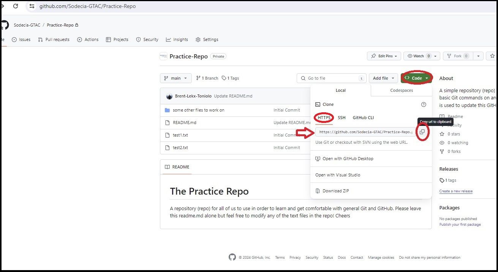
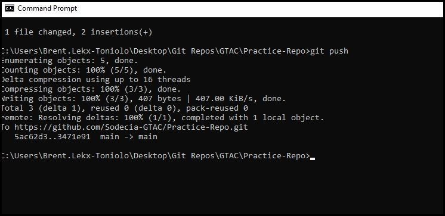

# Getting Started with GIT

## Installing (shown as of Git version 2.43.0)

Go to https://git-scm.com/download/win and grab the standalone installer, place a copy on to your desktop:

Start the installer, read the license notice then click Next:

Leave the Select Destination Location as default:

Leave the Select Components selections as default:

Leave the Select Start Menu as default:

In the Choosing the default editor dialog, use the drop down to select Notepad as the editor Git will us:

In the Initial Branch dialog box, select the second radio buton and leave the name as "main":

Leave the PATH emnvironment selection default:

Leave the SSH executable default:

Leave the HTTPS Backend default:

Leave the Line Ending conversions as follows:

Set the Terminal Emulator to the "use Windows defauly console" radio button:

Leave the Git Pull behaviour as default:

Leave the Credential Helper as default:

Leave the Extra Options as default:

Leave the Experimental Options as default (all deselected):

---

## Common Terms

### Git (Git and GitHub are NOT the same thing)
https://en.wikipedia.org/wiki/Git

### GitHub (GitHub is NOT Git, Github uses Git)
https://en.wikipedia.org/wiki/GitHub

### Repo (aka, repository)
Although this is not a term specific to GTAC, you will hear the term "repo" often.
A repository (or repo for short) is essentially just a grouped collection of stuff. 
For us, we group our FW levels and other project work into separate repos. Each repo contains all of the code, files, guides etc associated with that FW level or Project.
What makes a repo different then just say a group of stuff in a folder is that anything contained in the repos context is tracked, each files revision history can be seen. 
You will also see we often contain discussions, issues and general project tracking items in each repo as well.
You will be assigned different access levels to different repos as required by your manager / lead.

### Remote Repo
This is the central copy of a repo, stored on GitHub

### Local Repo
This is a copy of a remote repo local to your laptop

---

## Using

The following are some examples of how you will use commands to work with Git + GitHub

### My Lead has assigned me to work on a machine, they have already created a Remote Repo for the machine and told me to clone it, how do I do this?
First, if you haven't already done so, make a Git Repos folder on your laptop, keep all your local repos in here.
While this is not a mandatory step it is HIGHLY advised that you get into the practice of keeping things organzied.
To clone a remote repo we will use the git clone command in cmd.exe (windows command line), it looks like this:

#### git clone [url]

You will replace the [url] part with the url to the remote repo you want to clone.
This url can be found on ANY remote repo by going to it and finding it here:

So, open cmd.exe (windows command line), navigate to the Git Repos folder you made above and type in git clone plus the url you copied above:

Note: it is quite normal for a clone command to take a while to execute as a clone is creating a copy of the entire repo.
Once cloned we will then interact with the repo thru push and pull commands, these will be much faster.
You will now have a copy of the remote repo on your laptop / PC. this copy is called the local repo!
You are now free to edit the files contained in your local repo.

### I previouslly cloned a repo but haven't worked on my local repo in a while, I suspect other programers have pushed changes to the the remote, meaning my local is out of date, how do I updated my local?
If you already have a somewhat recent clone of a remote repo, local to your laptop / PC, you can simply "pull" in change changes (commits) to your local from the remote.
To pull in commits simply open cmd.exe , navigate to your local repo and type:

#### git pull

This will update your local repo with any commits other's may have pushed to the remote that your local doesn't have yet.
Note: When working on repos that you know other's may be pushing to as well, it's a good habit to perform a pull before you commit and push any changes you've made to your local.

### I have edited some files in my local repo and am happy with the edits. I'm ready to send these changes to the remote repo, what do I do?
This will be accomplished by using a sequence of commands, this entire sequence is not mandatory but IS a good sequence yo get into the habit of doing.
Before beginning, IF you suspect the remote repo has had other programmers push changes to it, see git pull above first.

1. Open cmd.exe (windows command line), navigate right into your repo base folder, then enter:

#### git add -A

This ensures that if you've added any new files to the local repo, they become part of what is tracked in the repo

2. Now enter:

#### git commit -a

This tells git to commit (or take a snap shot of) all changes that have happened in the repo since the last time you commited
At this point git will open notepad and ask you to enter commit notes. While your commit notes don't have to list out every detail of all changes you've made, it
is a good idea to add enough detail that anyone reading your commit notes will be able to understand what you worked on in the general sense.
Once you're done entering your commit notes, save then close notepad, you will be returned to the cmd window.

3. Finally, enter:

#### git push

This will push all commited changes to the remote repo!

Here are a couple of screen shot to show the above in action.

Add and Commit (with notepad open and comit notes added):

Final Push to remote repo:

At this point, you can open GitHub and confirm your commit / push took place:

---

## Practice
We have a practice repo located here: https://github.com/Sodecia-GTAC/Practice-Repo

Using what you read in the "Using" section above and to help you get comfortable with Git, you should try the following (in order):

1. Clone the Practice Repo to create a local copy onto your laptop / PC
2. Make some changes to any of the test.txt files in the newly created local repo
3. Commit the changes. When Notepad opens to get your commit notes, add your name, date and some notes about what you changed
4. Push the commit to the remote repo
5. Check on Github that the commit was pushed successfully

Practice as many times as it takes for you to feel comfortable. If you can do the above without looking at any reminders then you're off to a good start!
Have fun!!
